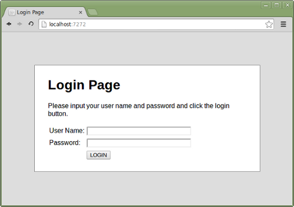

SDA - Simple Demo Application
=============================

Simple Demo Application is a login page to practice with automated testing on localhost.
Use login ``sda`` and password ``test`` you get into a welcome page.
Any other parameters will bring an error page

Setup
=====
1. `git clone git@github.com:brainly/automated_tests_gui.git`
2. navigate to project directory
3. run `pip install -r requirements.txt` to install all necessary dependencies
4. run `python demoapp/server.py` to start application
5. After an application is started, it should be available in URL `http://localhost:7272`
